# 光影瞬间 - 个人旅行摄影网站设计与实现

## 项目简介

"光影瞬间"是一个个人摄影作品展示网站，由田笑喧（软件工程2304班）开发。该项目展示了一位热爱旅行与摄影的学生的作品集，包含丰富的摄影作品、个人介绍和联系方式。

网站以"旅途"为主题，通过精美的视觉设计和交互体验，展示作者在不同地点的摄影作品，包括武汉、上海、安徽等地的风景和人文照片。所有照片均由本人亲自拍摄，为网站增添了个人特色和情感联结。

## 项目结构

```
.
├── index.html          # 主页 - 网站入口
├── reviews.html        # 作品集 - 摄影作品展示
├── about.html          # 关于我 - 个人介绍
├── contacts.html       # 联系我 - 联系方式和反馈表单
├── styles.css          # 主样式文件
├── README.md           # 项目说明文档
└── img/                # 图片资源目录
    ├── logo.png        # 网站Logo
    ├── bac 1.png       # 背景图片1
    ├── bac 2.png       # 背景图片2
    ├── bac 3.png       # 背景图片3
    ├── bac 4.png       # 背景图片4
    ├── gallery01-05.jpg # 画廊图片
    ├── card1 01-06.jpg  # 武汉系列照片
    ├── card2 01-05.jpg  # 上海系列照片
    ├── card3 01-08.jpg  # 安徽系列照片
    ├── my01.jpg        # 个人照片
    ├── recent01-03.jpg # 最新作品
    └── video2024.mp4   # 摄影幕后视频
```

# **1. 网站完整性**

## **1.1 网页完整性**

网站的网页设计注重功能的全面性和用户的便捷操作。登录页面通过表单的方式提供了用户验证功能。通过输入用户名和密码，用户可以完成身份认证，进入个人中心或浏览特定的内容，增强了网站的安全性和用户的隐私保护。

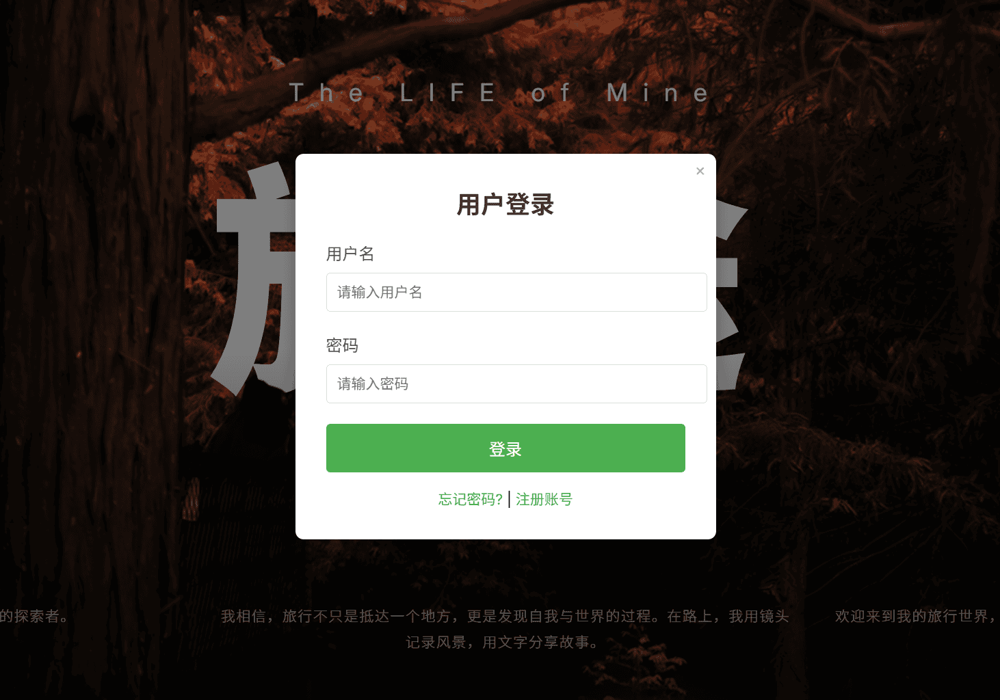
**图1-1 用户登陆界面**

联系页面则为用户提供了与网站管理员或相关工作人员沟通的渠道。该页面包含了邮箱、电话以及留言板等功能，方便用户提出问题、反馈建议或进行其他沟通交流。这不仅增强了网站与用户的互动性，也体现了网站对用户意见和反馈的重视。

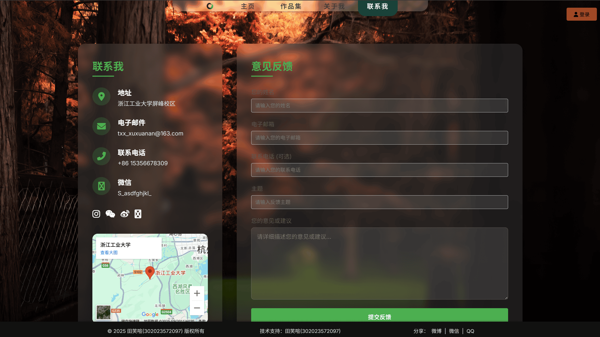
**图1-2 联系界面**

主页作为网站的核心展示区，展示了网站的主要内容和服务。通过直观的页面布局，用户可以迅速了解网站的核心功能和所提供的服务。

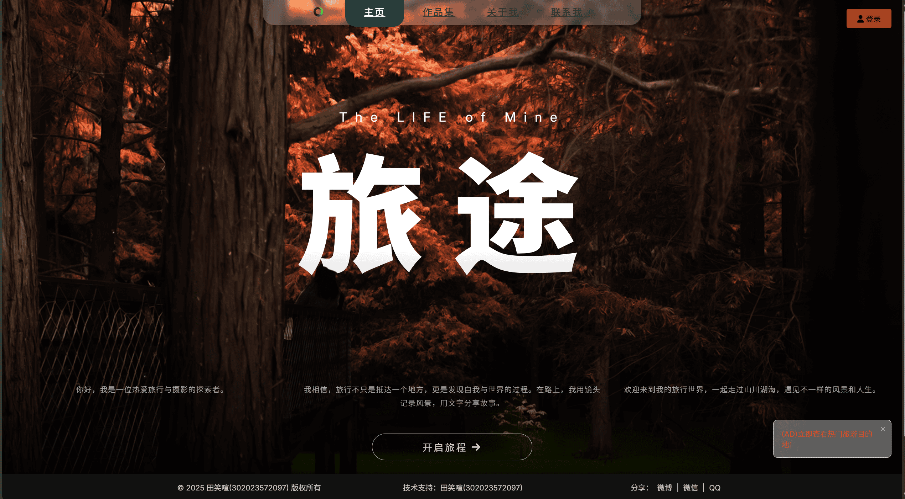
**图1-3 主界面（进入是视差滚动效果）**

网站还设有分类展示页面，这一页面通过分类目录将网站的内容按类型或主题进行清晰分组，用户可以根据自己的兴趣选择不同的分类进行浏览。方便用户快速定位所需信息。

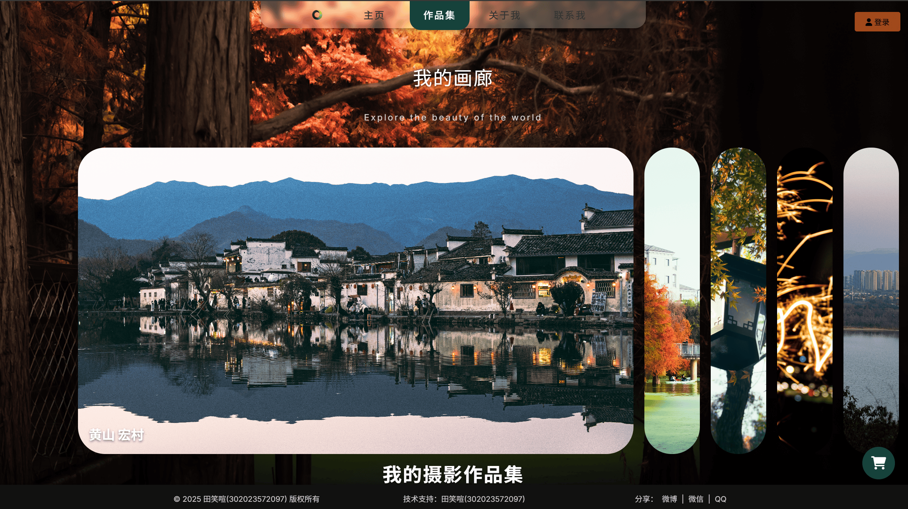
**图1-4 作品集页面**

通过以上多个页面的设计，网站不仅实现了功能的多样性和全面性，还提升了用户的体验。无论是新用户还是老用户，都能通过清晰的导航和完善的页面布局，快速找到所需的信息，享受流畅、舒适的浏览体验。

## **1.2 主页完整性**

主页的设计有明确的布局分区，确保了内容的清晰展示。页眉区包含了网站的Logo和导航栏，便于用户快速访问各个部分；banner广告区通过动态效果吸引用户注意，提供重要的信息；正文区则展示了核心内容，副栏区提供了辅助信息，如推荐内容；页脚区包含了版权信息、技术支持和社交媒体链接，提升了网站的完整性和专业性。

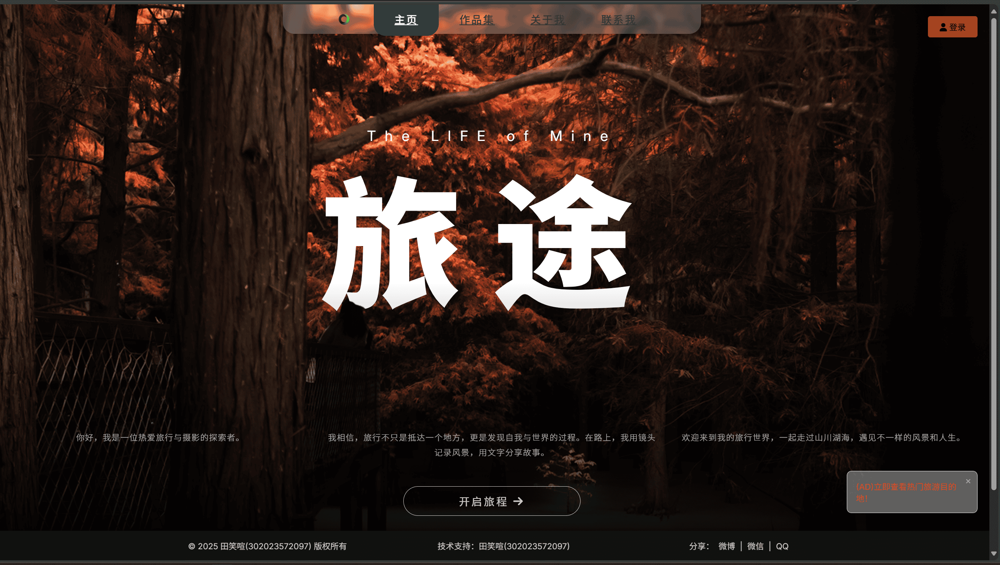
**图1-5 未关闭广告前的主页**


**图1-6 页脚区展示**

## **1.3 网页元素多样性**

为了提高用户的交互体验，网站不仅注重视觉上的表现，还通过多样化的元素设计提升了功能性和互动性。列表展示了内容的概要，用户可以快速浏览不同的类别和内容，节省了他们的时间和精力。文字部分则提供了详细的说明和解释，帮助用户更深入地了解每个主题或项目。通过清晰、有条理的文字排版，用户可以轻松获取所需信息，避免了冗长或复杂的表达。

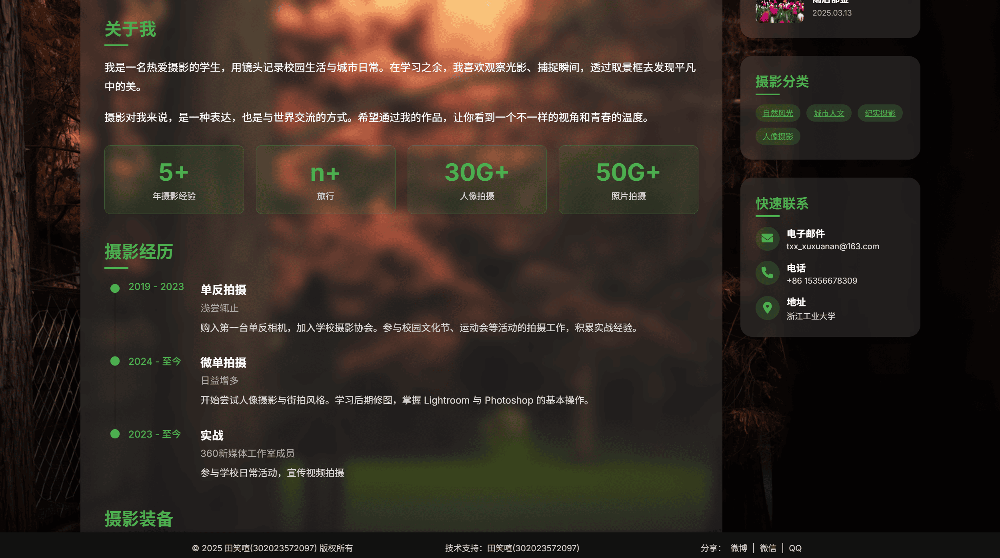
**图1-7 关于我界面文字排版展示**

图片作为网站的重要视觉元素，展示了与每个内容相关的高质量图像，吸引用户的目光并提供直观的感官体验。这些图片与文字内容相辅相成，让用户在浏览时更加沉浸于内容中，增强了网站的视觉冲击力。

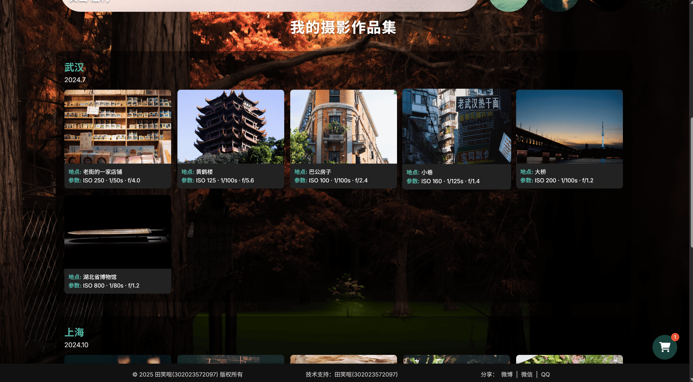
**图1-8 部分图片排版展示**

视频播放功能进一步增强了网站的互动性，用户可以通过视频观看更加生动、立体的内容。视频不仅能够提供更详细的信息，还能够传递情感和氛围，尤其是在旅游主题网站中，视频能够帮助用户感受目的地的美丽与特色。通过视频的播放，网站呈现出动态、丰富的体验，激发用户的兴趣和参与感。

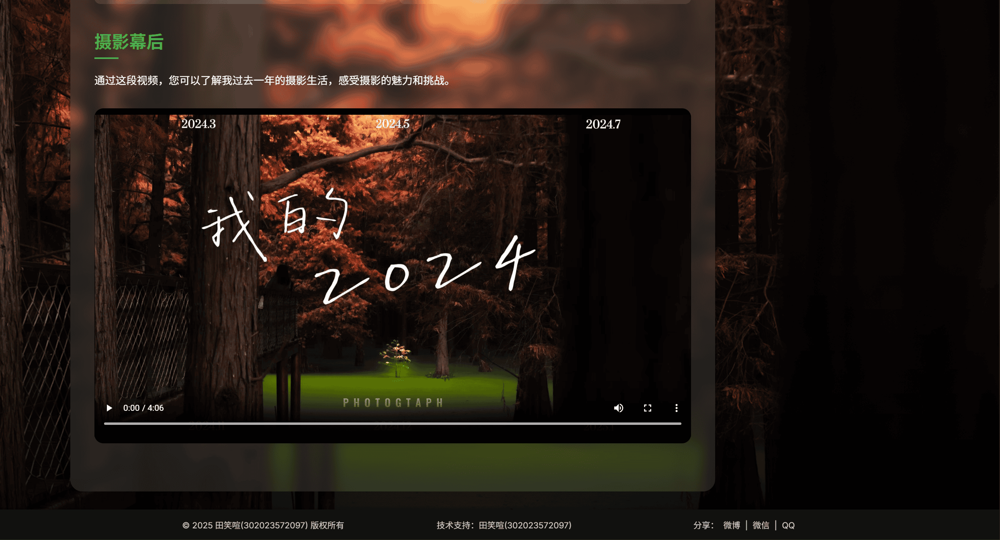
**图1-9 关于我 底部视频展示**

通过这些多样化的元素设计，网站能够提供更加丰富的用户体验，既满足了不同用户的需求，又增强了用户与网站之间的互动与参与感，使得整个网站不仅是一个信息的展示工具，更是一个生动、富有活力的互动平台。

# **2. 网站设计**

## **2.1 整体设计**

网站的布局和样式设计充分考虑了视觉美感和用户体验。整体布局简洁且直观，页眉、正文、页脚区分明确，颜色搭配上采用了符合主题的色彩方案，避免了色彩的过度使用，保持了视觉的统一性。边距设计合理，使得每个部分之间的内容不会显得拥挤，增强了网页的可读性和舒适性。

网页的配色和设计是其整体美感和用户体验的重要组成部分。为了突出旅游主题，网站采用了黑色、灰色和绿色的简约配色方案。黑色作为背景色，给人一种沉稳、深邃的感觉，有助于突出页面中的内容和图像；灰色则作为辅助色，既起到缓解视觉冲击的作用，也让页面看起来更加柔和、优雅；绿色则作为点缀色，用来强调重要的交互元素，如按钮、链接和导航栏，既引导用户的注意力，也增加了整体设计的活力和现代感。

在设计风格上，整个网站保持了一种简洁大气的布局，避免了过多的装饰性元素，使得页面更加专注于内容的展示。每个区块的空间布局合理，边距设计得体，确保了页面的整洁和可读性。同时，颜色和排版上的搭配也强调了信息的层次感，确保用户能够轻松地找到自己所需要的信息。

这种配色和设计风格，既符合旅游网站的视觉需求，又能在用户使用过程中提供舒适的视觉体验，提升了网站的互动性和吸引力。


**图2-1 网站logo展示（黑底版）**

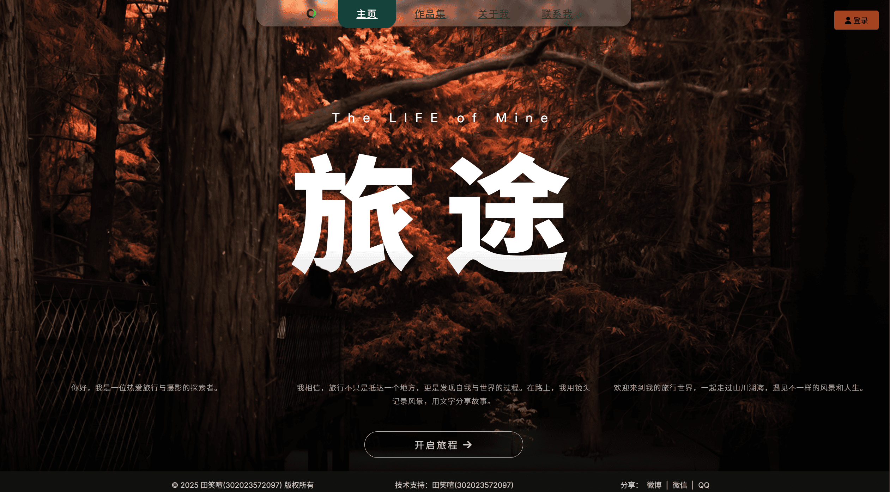
**图2-2 网站整体展示**

## **2.2 元素样式设计**

网站中的各个元素样式设计独具匠心，导航链接设计简洁明了，用户可以快速定位到所需页面。广告样式设计上，采用了动态的展示方式，确保了广告信息的有效传达。图文混排设计使得页面内容既有可读性，又具备视觉冲击力，提升了用户的浏览体验。

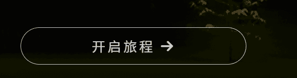
**图2-3 “链接图标”未点击的样子**

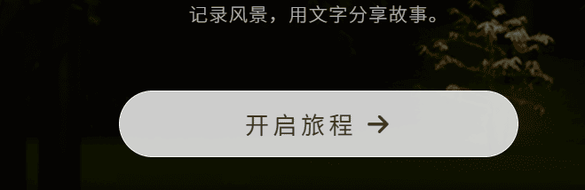
**图2-4 “链接图标”指针放上后的样子（点击跳转到作品集页面）**

# **3. 网站功能**

## **3.1 数据验证**

在登录页面和联系页面中，我们实现了数据验证功能，确保了用户输入信息的准确性。登录页面通过检查用户名和密码的有效性，保障了安全性；联系页面则通过验证邮箱和联系方式，避免了垃圾信息的产生，提升了网站的互动性和用户体验。


**图3-1 用户登录界面**

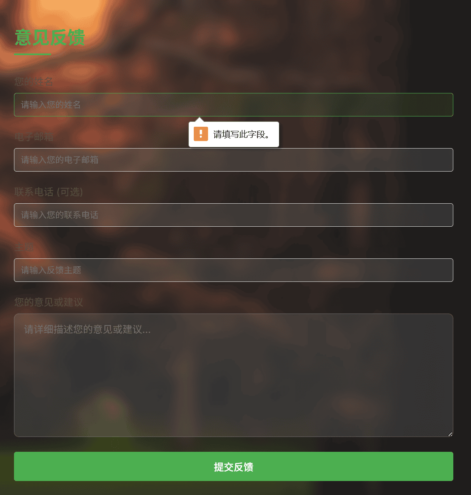
**图3-2 意见反馈填写字段为空时提示**

## **3.2 用户状态**

主页的用户状态功能能够实时显示当前登录用户的用户名，让用户始终了解自己的登录状态，增加了用户体验的连贯性和流畅感。

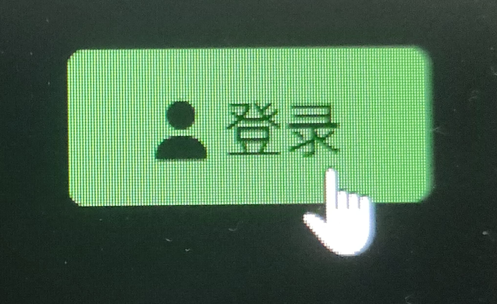
**图3-3 指针未放到登录图标的显示**  
  
**图3-4 指针放到登陆图标上的显示**

  
**图3-5 登录成功后显示用户名**

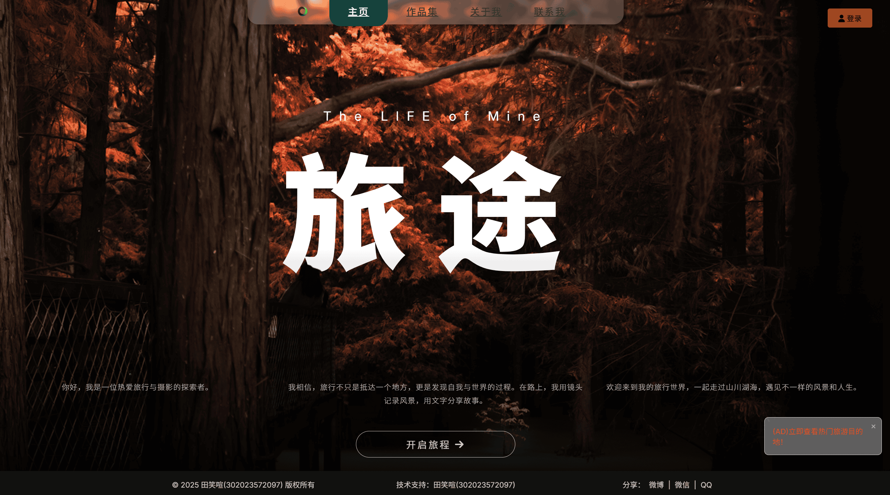
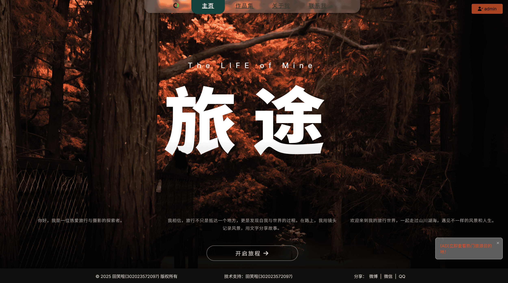
**图3-6 & 图 3-7 登录前后显示用户名**

## **3.3 图片切换**

为了提高视觉吸引力，主页实现了图片切换效果，用户可以通过手动操作进行切换，这一功能增强了页面的互动性，吸引了用户的关注。

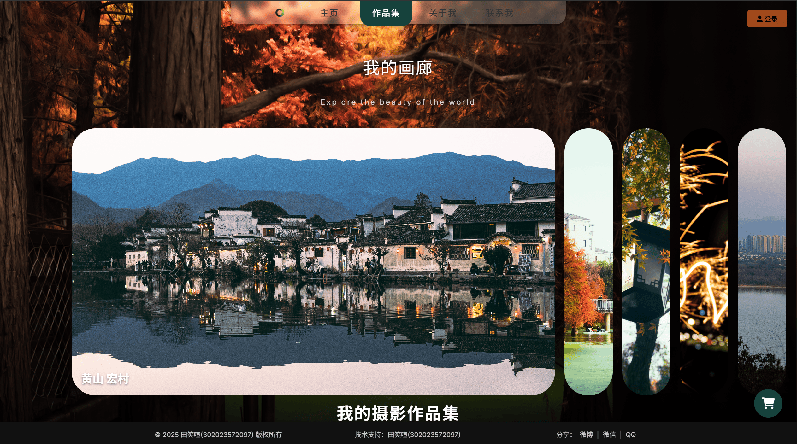
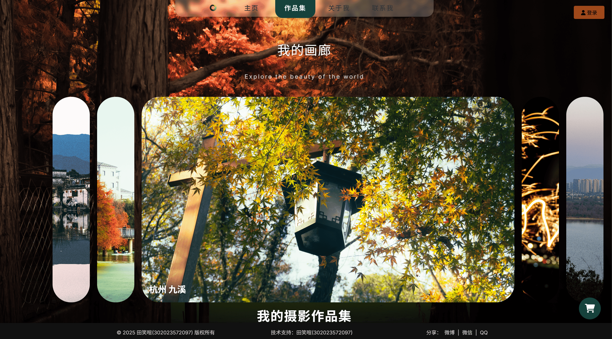
**图3-8 & 图 3-9 手风琴图片切换**

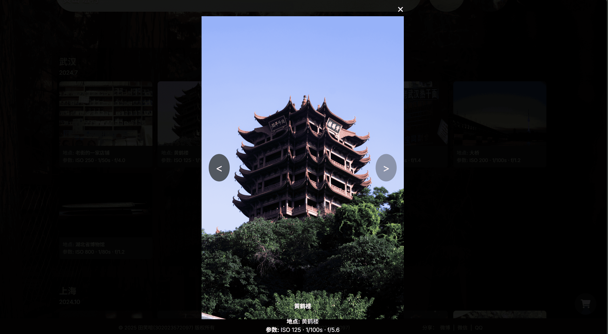
**图3-10 图片按钮切换**

## **3.4 浮动**

网站实现了浮动广告功能，广告在页面中根据用户的滚动而浮动。这一功能不仅提升了广告的可见度，同时也增加了页面的动感和交互性，改善了用户体验。

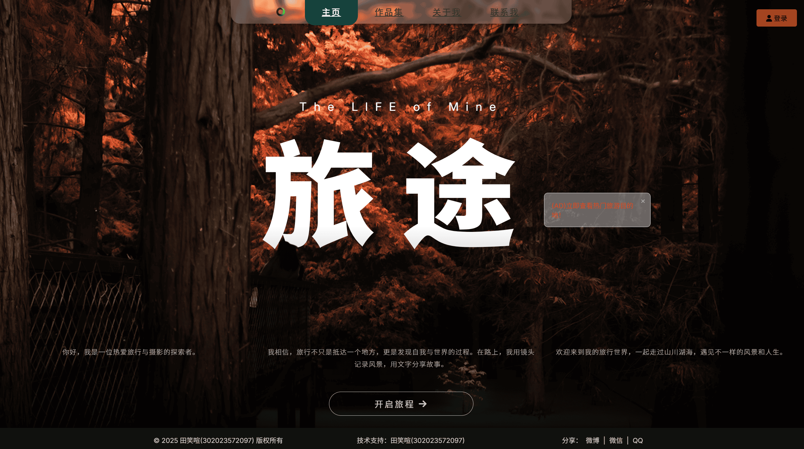

**图3-11 & 图3-12 拖拽广告位置**

## **3.5 拖放**

网站采用了拖放功能，用户可以将图像、商品等内容拖动到指定位置。这种交互方式使得操作更加直观，增强了用户的参与感和网站的互动性。

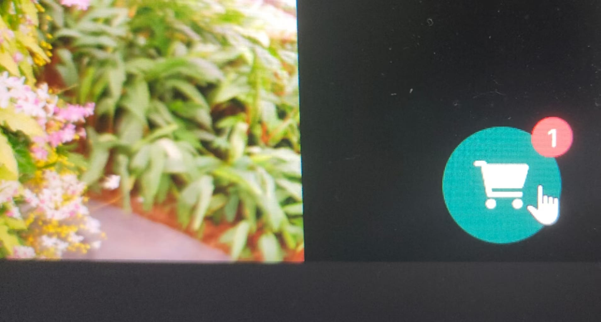
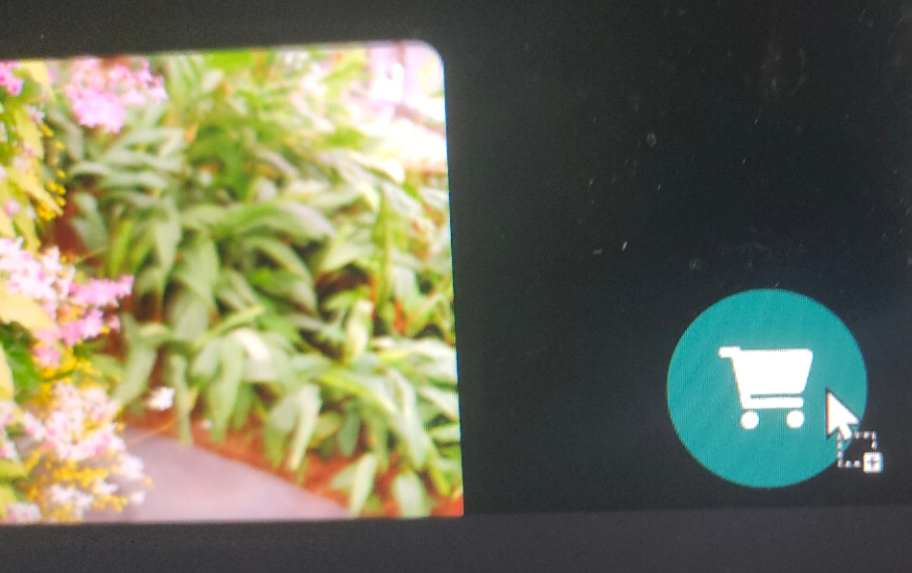
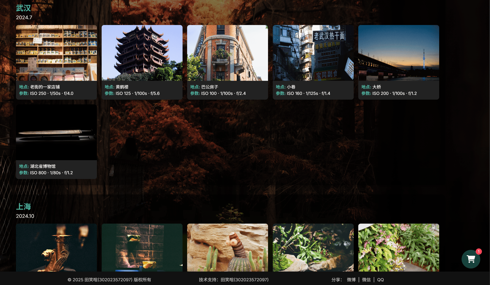
**图3-13 & 图3-14 & 图 3-15 图片拖入购物车以便集中下载（模拟）**

## **3.6 分页导航**

为了让用户更加方便地浏览内容，网站实现了分页导航功能。当内容过多时，用户可以通过分页进行浏览，避免了页面加载过慢的问题。这一功能的实现大大提升了用户的浏览体验，使得网站的内容更加条理清晰。

# **4. 网站亮点**

## **4.1 设计亮点**

网站的设计具有明显的特色，注重现代化简约风格的呈现，同时融入了动态效果，使得整体页面既简洁又充满活力。页面布局以清晰、直观为核心，确保用户能够快速找到所需内容，同时保持了一种平衡和有序的结构。在颜色搭配上，网站采用了黑、灰、绿的经典组合，既符合旅游主题的视觉需求，又提升了整体页面的视觉冲击力，避免了过于花哨的设计，给用户带来一种舒适的浏览体验。

网站的动态效果，如图片切换、浮动广告等设计，增加了页面的互动性和可玩性。这些动态效果不仅打破了静态网页的单调感，还使得用户在浏览过程中体验到更多的视觉冲击和惊喜。例如，图片切换功能使得广告或内容展示变得更加生动和富有变化，而浮动广告则让网站的宣传内容更加灵活地展示在用户面前，不干扰用户的主要操作，同时也能吸引他们的注意力。

此外，网站还引入了手风琴布局，这种布局设计使得内容展示更加紧凑而有序，用户可以通过点击不同的分类或标题展开内容，既节省了页面空间，又保持了信息的整洁性。手风琴布局的引入，提升了用户交互的流畅感，使得信息的层次结构更加清晰。


**图 4-1 手风琴布局展示**

所有的照片均由本人亲自拍摄，这不仅为网站增添了个人特色，也使得每张图片都承载了个人情感与创作的独特视角。这些原创摄影作品以极具艺术感和故事性的方式呈现，不仅提升了网站的视觉质量，也增加了与用户的情感联结。每张图片都是对目的地、景点或文化的深刻表达，通过个人的镜头语言，展示了不同的美感和细节，帮助用户更好地理解和感受旅游目的地的独特魅力。

此外，网站的进入动效也是一大亮点。进入网站时，页面会通过精心设计的动态过渡效果，使得用户在访问时感受到流畅且富有现代感的过渡体验。这个动效不仅为用户带来了愉悦的视觉体验，同时也增强了网站的吸引力，使得用户更愿意停留在网站上，探索更多内容。这种动效的设计提升了网站的整体专业性和吸引力，让用户在第一时间就能感受到网站独特的设计风格。

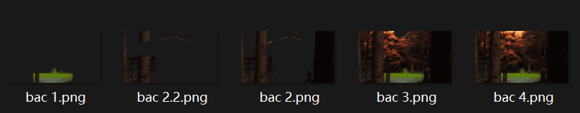
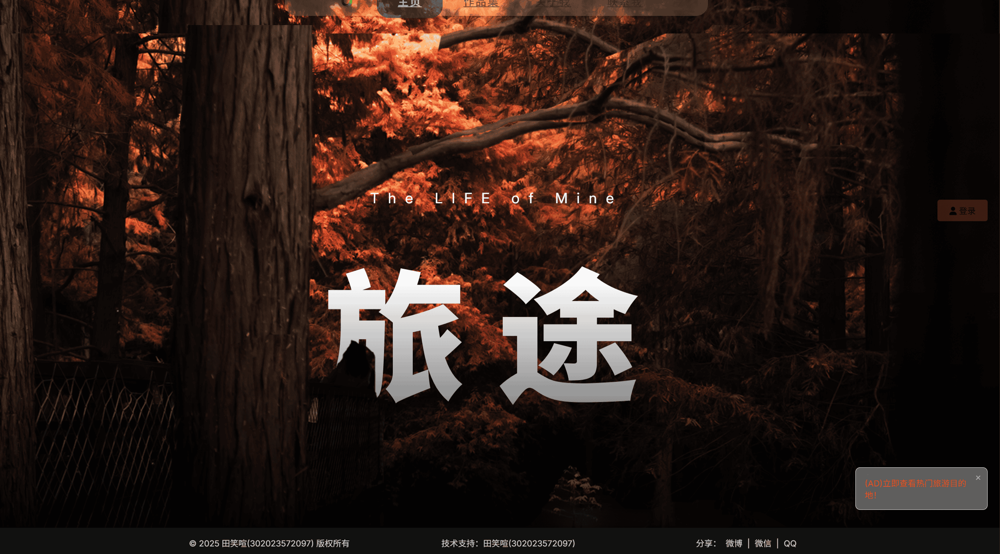
**图4-2 & 图4-3 主页视差滚动效果展示**

另一个显著的亮点是“联系我”页面中的地图功能。该页面通过集成互动地图，用户可以方便地查看和定位相关的地理信息。这不仅增强了网站的实用性，也使得用户能够直观地了解与网站相关的地理位置，如合作地点、旅游目的地或其他关键信息。地图功能的加入为用户提供了更高层次的互动体验，同时也提升了网站的专业感和便捷性。

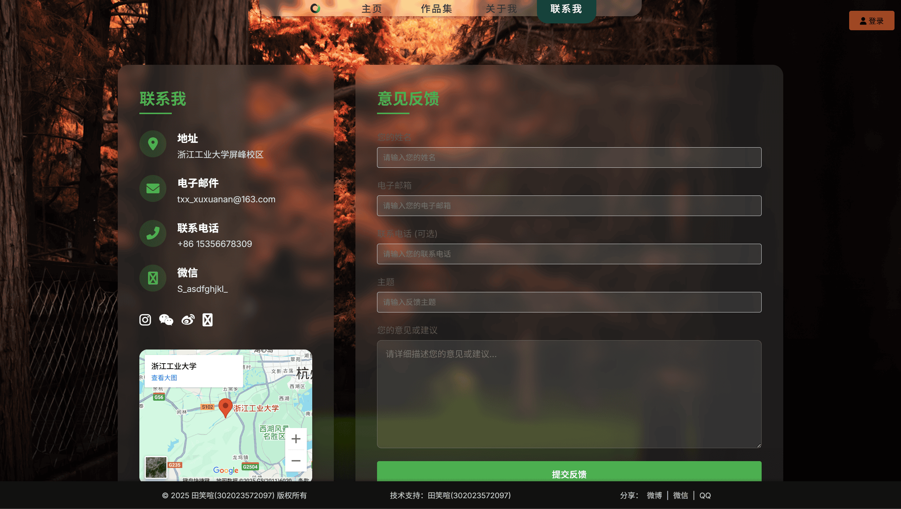
**图4-4 关于我地图界面展示（查看大图可直接跳转谷歌地图）**

这些设计亮点共同构成了一个既有现代感又富有创意的网站，既符合用户的浏览习惯，又能提供富有互动性和个性化的内容，使得整个网站在众多同类网站中脱颖而出，成为一个独特的体验平台。

## **4.2 技术亮点**

**图片切换效果**：通过巧妙实现的图片切换功能，网站的视觉内容得以动态展示。图片展示区域不仅在视觉上具有吸引力，用户还可以体验到流畅的切换效果，打破静态内容的局限性。这种切换效果可以应用于广告展示、内容展示等多个场景，增加了网页的动感，提升了用户的视觉享受。

**拖放功能**：拖放功能是一个非常实用的交互特性，它使得用户可以直接将页面元素进行拖动和放置。无论是将文件、图片或其他内容拖动到指定位置，还是进行某种交互任务，拖放功能的引入大大提升了网页的操作性和易用性。通过简单的拖放操作，用户可以轻松地与页面内容进行交互，体验到更加直观和便捷的操作方式。

**浮动广告与动态效果**：浮动广告不仅增强了网站内容的展示灵活性，还确保了广告与用户交互时的顺畅性。动态效果的设计使得广告和其他元素在页面上不断移动和变化，既能吸引用户的目光，又不会过于干扰用户的操作。这种技术使得广告内容可以根据用户的浏览习惯和需求灵活调整，增强了广告的展示效果和用户的参与感。

**用户状态显示**：通过技术手段实现了用户状态的显示功能，网站能够根据用户的登录信息展示个性化内容。例如，主页会显示当前用户的用户名，提升了用户的归属感与互动性。此外，用户的活动轨迹和偏好也可以根据技术实现动态调整，确保每位用户都能感受到独特的体验。

**动态页面加载与响应式设计**：网站采用了响应式设计，能够根据不同设备和屏幕尺寸调整页面布局，确保无论用户是通过手机、平板还是电脑访问，都能获得一致且优化的体验。此外，网站在数据加载方面也实现了异步加载（AJAX技术），保证了用户在访问时页面的快速响应，提升了整体性能，减少了等待时间。

**地图集成与位置服务**：网站的“联系我”页面通过集成互动地图功能，不仅提供了地理位置信息，还可以让用户与地图进行交互，查看不同地点的相关信息。这一技术提升了网站的实用性和信息量，使得用户可以快速获取与位置相关的数据，进一步增强了网站的互动性和用户体验。

**性能优化**：在技术实现过程中，网站还特别关注了性能的优化，确保了页面加载速度的快速性。通过合理的资源压缩、异步加载和缓存机制的运用，网站能够在不牺牲功能的前提下，提供流畅的浏览体验。这不仅提升了用户的使用感受，也减少了因页面缓慢加载而可能导致的用户流失。

这些技术亮点的实现，充分展示了网站在用户交互、功能实现和性能优化方面的优势，确保了用户在浏览过程中能够体验到既丰富又流畅的操作，同时也使得网站在竞争激烈的市场中占据了独特的技术优势。

## 功能特性总结

### 主页 (index.html)
- 响应式导航栏，支持页面切换
- 动态背景图片和文字动画效果（视差滚动效果）
- 用户登录功能（模拟）
- 浮动广告（可拖动）
- 一键跳转到作品集

### 作品集 (reviews.html)
- 交互式画廊展示（手风琴式图片切换）
- 照片分类展示（武汉、上海、安徽）
- 拖拽收藏功能（可拖拽照片到收藏框）
- 本地存储收藏列表
- 照片详细信息展示（地点、参数）

### 关于我 (about.html)
- 个人简介和照片
- 摄影经历时间线
- 摄影设备介绍
- 摄影统计数据
- 视频展示区
- 侧边栏（最新作品、摄影分类、联系方式）

### 联系我 (contacts.html)
- 联系信息展示（地址、邮箱、电话、微信）
- 交互式地图（集成Google Maps）
- 意见反馈表单
- 表单验证和成功提示
- 社交媒体链接

## 技术栈

### 前端技术
- **HTML5** - 页面结构
- **CSS3** - 样式设计
  - Flexbox 和 Grid 布局
  - CSS 动画和过渡效果
  - 响应式设计（支持移动端）
  - 毛玻璃效果（backdrop-filter）
- **JavaScript** - 交互功能
  - DOM 操作
  - 事件处理
  - 本地存储（localStorage）
  - 拖拽 API
  - 表单验证

### 外部资源
- **Font Awesome** - 图标库
- **Google Fonts** - 字体（Inter）
- **Google Maps API** - 地图集成
- **CDNJS** - 资源加速

### 设计特点
- 深色主题配合绿色点缀
- 毛玻璃效果和半透明背景
- 流畅的动画过渡
- 响应式布局
- 无障碍设计（ARIA标签）

## 如何运行

### 方法一：直接打开（推荐）
1. 确保所有文件在同一个目录下
2. 双击 `index.html` 文件
3. 使用现代浏览器（Chrome、Firefox、Edge等）打开

### 方法二：使用本地服务器
1. 安装 Python（如果未安装）
2. 在项目目录打开命令行
3. 运行以下命令之一：

```bash
# Python 3
python -m http.server 8000

# Python 2
python -m SimpleHTTPServer 8000
```

4. 在浏览器中访问 `http://localhost:8000`

### 方法三：使用 Node.js
1. 安装 Node.js
2. 安装 http-server：
```bash
npm install -g http-server
```
3. 在项目目录运行：
```bash
http-server
```
4. 访问控制台显示的地址

## 使用说明

### 导航
- 点击顶部导航栏在不同页面间切换
- 当前页面会高亮显示

### 作品集功能
1. **查看照片**：点击画廊中的卡片会展开显示
2. **收藏照片**：拖拽照片到右下角的收藏图标
3. **查看收藏**：点击收藏图标查看已收藏的照片
4. **下载收藏**：在收藏框中点击"下载全部"
5. **清空收藏**：在收藏框中点击"清空"

### 登录功能
- 点击右上角"登录"按钮
- 输入用户名和密码（模拟登录）
- 登录成功后按钮会显示用户名

### 联系表单
1. 在"联系我"页面填写反馈表单
2. 所有带*的字段为必填项
3. 提交后会显示成功提示

## 浏览器兼容性

- ✅ Chrome 60+
- ✅ Firefox 55+
- ✅ Safari 10+
- ✅ Edge 79+
- ⚠️ Internet Explorer - 不支持

## 开发说明

### 代码结构
- 每个HTML文件包含独立的样式和脚本
- CSS使用模块化设计，按功能分类
- JavaScript使用事件驱动编程
- 图片资源按功能分类存放

### 扩展功能建议
1. 添加后端支持（Node.js + Express）
2. 实现真实的用户认证
3. 添加照片上传功能
4. 集成社交媒体分享
5. 添加照片搜索功能
6. 实现评论系统

# **5. 总结**

## **5.1 知识点总结**

HTML和CSS是Web开发的基石，掌握HTML的基本标签和结构，以及CSS的布局、样式设置，能够帮助我们快速构建静态页面。我深入学习了HTML标签的使用，如<div>、<header>、<footer>等，以及如何通过CSS实现响应式设计，控制布局和样式，保证网站在不同设备上的兼容性和可访问性。

JavaScript作为前端开发的重要工具，能够让静态页面变得动态和交互。我学习了如何使用JavaScript进行事件处理、数据验证、用户状态显示等操作。通过实现图片切换、拖放功能、分页导航等交互特效，我意识到JavaScript在增强用户体验和实现动态效果方面的重要性。还包括了现代前端开发工具和框架。在学习这些框架的过程中，我了解了前端开发中的组件化思想、单向数据流、虚拟DOM等概念，逐渐意识到框架在提高开发效率、降低维护成本方面的巨大优势。

性能优化也是课程中的重要内容之一。通过学习如何进行网页性能优化，我掌握了如图片压缩、延迟加载、浏览器缓存等技术，了解了如何在不牺牲用户体验的情况下提升网页加载速度。这对网站的长期发展至关重要，尤其是当访问量增大时。

## **5.2 前端技术在社会上的发展体会**

前端技术在社会上的发展可谓日新月异。随着互联网技术的不断发展，前端开发已经不再局限于简单的网页设计，逐渐演变为用户交互和体验的重心。现如今，前端开发不仅涉及HTML、CSS和JavaScript，还包括了前端框架、工具链、单页面应用（SPA）、服务端渲染（SSR）等技术，极大地丰富了前端开发的工具箱。

随着移动互联网的普及和智能设备的广泛应用，前端开发在响应式设计、移动端适配等方面扮演着越来越重要的角色。同时，Web应用和原生应用的边界逐渐模糊，前端开发的跨平台能力也成为了行业的重要需求。像Electron、React Native等技术，让前端开发不仅限于浏览器端，也能够开发桌面应用和移动应用。

另外，随着Web标准的不断发展和浏览器技术的不断更新，前端技术越来越趋向于模块化、组件化、自动化，开发效率大大提高。对于开发者来说，前端技术的未来充满了挑战和机遇，同时也需要持续学习和更新知识，跟上技术发展的步伐。

## 作者信息

- **姓名**：田笑喧
- **邮箱**：txx_xuxuanan@163.com
- **电话**：+86 15356678309

---

**注意**：本项目为个人学习作品，部分功能为模拟实现（如登录、表单提交）。实际部署时需要添加后端支持。