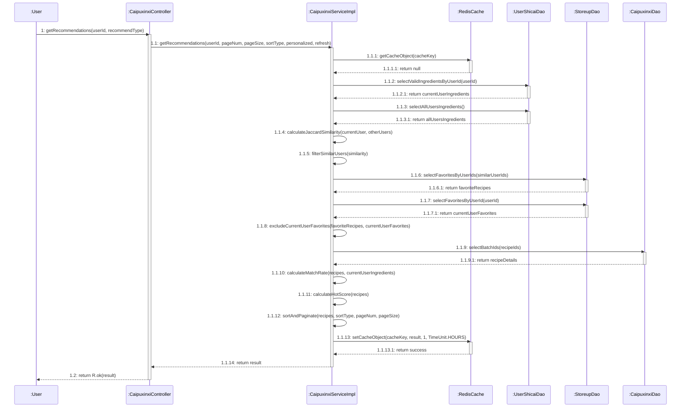
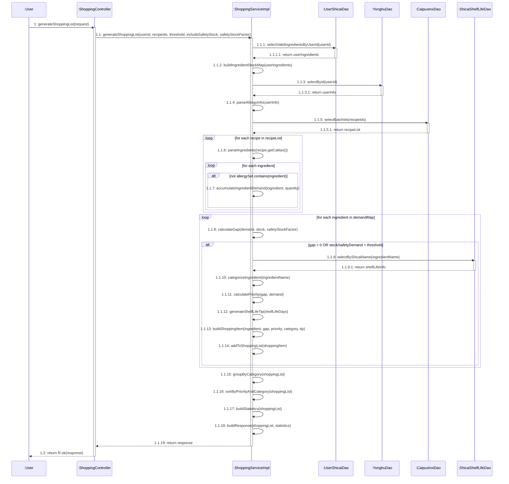
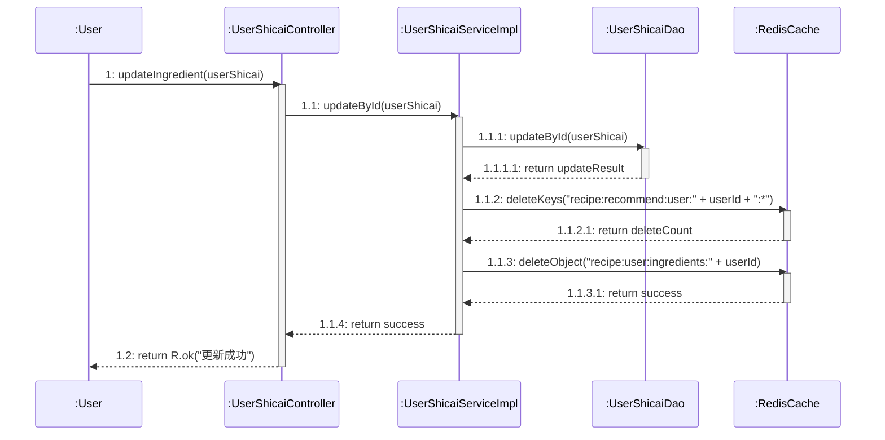

# 智能厨房管理系统核心功能顺序图

本文档包含系统三大核心功能的 Mermaid 顺序图，严格遵循 UML 顺序图绘制规范。

---

## 一、食谱智能推荐功能顺序图

### 1.1 基于库存推荐流程

```mermaid
sequenceDiagram
    participant user as :User
    participant ctrl as :CaipuxinxiController
    participant svc as :CaipuxinxiServiceImpl
    participant cache as :RedisCache
    participant dao as :CaipuxinxiDao
    participant userDao as :UserShicaiDao
    participant yonghuDao as :YonghuDao
    
    user->>ctrl: 1: getRecommendations(userId, recommendType)
    activate ctrl
    
    ctrl->>svc: 1.1: getRecommendations(userId, pageNum, pageSize, sortType, recommendType, refresh)
    activate svc
    
    alt refresh=false
        svc->>cache: 1.1.1: getCacheObject(cacheKey)
        activate cache
        cache-->>svc: 1.1.1.1: return cachedResult
        deactivate cache
        
        alt cachedResult != null
            svc-->>ctrl: 1.1.2: return cachedResult
            deactivate svc
            ctrl-->>user: 1.2: return R.ok(cachedResult)
            deactivate ctrl
        else cachedResult == null
            Note over svc: Continue to query database
        end
    else refresh=true
        Note over svc: Skip cache, query database directly
    end
    
    svc->>userDao: 1.1.3: selectValidIngredientsByUserId(userId)
    activate userDao
    userDao-->>svc: 1.1.3.1: return userIngredients
    deactivate userDao
    
    svc->>yonghuDao: 1.1.4: selectById(userId)
    activate yonghuDao
    yonghuDao-->>svc: 1.1.4.1: return userInfo
    deactivate yonghuDao
    
    svc->>svc: 1.1.5: parseHealthPreference(userInfo)
    
    svc->>dao: 1.1.6: selectList(queryWrapper)
    activate dao
    dao-->>svc: 1.1.6.1: return recipeList
    deactivate dao
    
    svc->>svc: 1.1.7: calculateMatchRate(recipe, userIngredients)
    svc->>svc: 1.1.8: calculateHotScore(recipe)
    svc->>svc: 1.1.9: applyHealthPreferenceBonus(recipe, healthPreference)
    svc->>svc: 1.1.10: filterDuplicates(recipeList, userId)
    svc->>svc: 1.1.11: sortAndPaginate(recipeList, sortType, pageNum, pageSize)
    
    svc->>cache: 1.1.12: setCacheObject(cacheKey, result, 1, TimeUnit.HOURS)
    activate cache
    cache-->>svc: 1.1.12.1: return success
    deactivate cache
    
    svc-->>ctrl: 1.1.13: return result
    deactivate svc
    
    ctrl-->>user: 1.2: return R.ok(result)
    deactivate ctrl
```

### 1.2 个性化推荐（协同过滤）流程



---

## 二、用户偏好设置功能顺序图

### 2.1 查询用户偏好流程

```mermaid
sequenceDiagram
    participant user as :User
    participant ctrl as :YonghuController
    participant svc as :YonghuServiceImpl
    participant dao as :YonghuDao
    
    user->>ctrl: 1: getUserPreference(userId)
    activate ctrl
    
    ctrl->>svc: 1.1: getUserPreference(userId)
    activate svc
    
    svc->>dao: 1.1.1: selectById(userId)
    activate dao
    dao-->>svc: 1.1.1.1: return userEntity
    deactivate dao
    
    alt userEntity == null
        svc-->>ctrl: 1.1.2: throw RuntimeException
        ctrl-->>user: 1.2: return R.error(user not exist)
        deactivate ctrl
        deactivate svc
    else userEntity != null
        svc->>svc: 1.1.3: buildUserPreferenceDTO(userEntity)
        svc-->>ctrl: 1.1.4: return preferenceDTO
        deactivate svc
        ctrl-->>user: 1.2: return R.ok(preferenceDTO)
        deactivate ctrl
    end
```

### 2.2 更新用户偏好流程

```mermaid
sequenceDiagram
    participant user as :User
    participant ctrl as :YonghuController
    participant svc as :YonghuServiceImpl
    participant dao as :YonghuDao
    participant cache as :RedisCache
    participant mapper as :ObjectMapper
    
    user->>ctrl: 1: updatePreference(request)
    activate ctrl
    
    ctrl->>ctrl: 1.1: getSessionUserId()
    
    alt sessionUserId != request.userId
        ctrl-->>user: 1.2: return R.error(no permission)
        deactivate ctrl
    else sessionUserId == request.userId
        ctrl->>svc: 1.3: updatePreference(request)
        activate svc
        
        svc->>dao: 1.3.1: selectById(userId)
        activate dao
        dao-->>svc: 1.3.1.1: return userEntity
        deactivate dao
        
        alt userEntity == null
            svc-->>ctrl: 1.3.2: throw RuntimeException
            ctrl-->>user: 1.4: return R.error(user not exist)
            deactivate ctrl
            deactivate svc
        else userEntity != null
            svc->>mapper: 1.3.3: readTree(healthPreferenceJson)
            activate mapper
            mapper-->>svc: 1.3.3.1: return jsonNode
            deactivate mapper
            
            alt jsonNode == null
                svc-->>ctrl: 1.3.4: throw RuntimeException
                ctrl-->>user: 1.4: return R.error(JSON format error)
                deactivate ctrl
                deactivate svc
            else jsonNode != null
                svc->>svc: 1.3.5: updateUserEntity(userEntity, request)
                
                svc->>dao: 1.3.6: updateById(userEntity)
                activate dao
                dao-->>svc: 1.3.6.1: return updateResult
                deactivate dao
                
                svc->>cache: 1.3.7: deleteKeys(recipe:recommend:user:userId:*)
                activate cache
                cache-->>svc: 1.3.7.1: return deleteCount
                deactivate cache
                
                svc->>cache: 1.3.8: deleteObject(recipe:user:allergy:userId)
                activate cache
                cache-->>svc: 1.3.8.1: return success
                deactivate cache
                
                svc-->>ctrl: 1.3.9: return success
                deactivate svc
                
                ctrl-->>user: 1.4: return R.ok(update success)
                deactivate ctrl
            end
        end
    end
```

### 2.3 向导式初始化偏好流程

```mermaid
sequenceDiagram
    participant user as :User
    participant ctrl as :YonghuController
    participant svc as :YonghuServiceImpl
    participant dao as :YonghuDao
    participant cache as :RedisCache
    
    user->>ctrl: 1: initPreference(request)
    activate ctrl
    
    ctrl->>ctrl: 1.1: getSessionUserId()
    
    alt sessionUserId != request.userId
        ctrl-->>user: 1.2: return R.error(no permission)
        deactivate ctrl
    else sessionUserId == request.userId
        ctrl->>svc: 1.3: initPreference(request)
        activate svc
        
        svc->>dao: 1.3.1: selectById(userId)
        activate dao
        dao-->>svc: 1.3.1.1: return userEntity
        deactivate dao
        
        alt userEntity == null
            svc-->>ctrl: 1.3.2: throw RuntimeException
            ctrl-->>user: 1.4: return R.error(user not exist)
            deactivate ctrl
            deactivate svc
        else userEntity != null
            svc->>svc: 1.3.3: buildHealthPreferenceJson(request)
            svc->>svc: 1.3.4: updateUserEntity(userEntity, healthPreferenceJson, allergyInfo)
            
            svc->>dao: 1.3.5: updateById(userEntity)
            activate dao
            dao-->>svc: 1.3.5.1: return updateResult
            deactivate dao
            
            svc->>cache: 1.3.6: deleteKeys(recipe:recommend:user:userId:*)
            activate cache
            cache-->>svc: 1.3.6.1: return deleteCount
            deactivate cache
            
            svc->>cache: 1.3.7: deleteObject(recipe:user:allergy:userId)
            activate cache
            cache-->>svc: 1.3.7.1: return success
            deactivate cache
            
            svc-->>ctrl: 1.3.8: return success
            deactivate svc
            
            ctrl-->>user: 1.4: return R.ok(init success)
            deactivate ctrl
        end
    end
```

---

## 三、智能采购清单功能顺序图

### 3.1 生成采购清单流程



### 3.2 导出采购清单流程

```mermaid
sequenceDiagram
    participant user as :User
    participant ctrl as :ShoppingController
    participant svc as :ShoppingServiceImpl
    participant mapper as :ObjectMapper
    
    user->>ctrl: 1: exportShoppingList(userId, listId, format)
    activate ctrl
    
    ctrl->>svc: 1.1: exportShoppingList(userId, listId, format)
    activate svc
    
    svc->>svc: 1.1.1: getShoppingListFromCache(listId)
    
    alt shoppingList == null
        svc-->>ctrl: 1.1.2: throw RuntimeException
        ctrl-->>user: 1.2: return R.error(list not exist)
        deactivate ctrl
        deactivate svc
    else shoppingList != null AND format equals json
        svc->>mapper: 1.1.3: writeValueAsString(shoppingList)
        activate mapper
        mapper-->>svc: 1.1.3.1: return jsonString
        deactivate mapper
        
        svc-->>ctrl: 1.1.4: return jsonString
        deactivate svc
        
        ctrl-->>user: 1.2: return R.ok(jsonString)
        deactivate ctrl
    end
```

---

## 四、缓存自动更新流程顺序图

### 4.1 食材变更触发缓存清除



---

## 五、规范说明

### 5.1 命名标注规范

本文档中的顺序图严格遵循以下命名规范：

1. **仅类名格式**：`:ClassName`（如 `:User`、`:RedisCache`）
2. **对象名+类名格式**：`objectName : ClassName`（如 `ctrl : CaipuxinxiController`）
3. **仅对象名格式**：`objectName`（如 `user`、`cache`）

### 5.2 消息标注规范

消息标注遵循以下格式：

```
[sequence-expression] message-name([argument-list])
```

- **顺序表达式**：使用句点分隔（如 `1.1.1`、`1.1.2`）
- **消息名**：首字母小写（如 `getRecommendations`、`selectById`）
- **参数列表**：用括号包裹（如 `(userId, pageNum)`）
- **返回值**：使用虚线箭头标注（如 `return result`）

### 5.3 控制焦点规范

- 使用 `activate` 和 `deactivate` 标记对象的激活期
- 激活期从消息接收开始，到返回消息结束
- 嵌套调用时，内层激活期完全包含于外层

### 5.4 条件分支规范

- 使用 `alt` 标记条件分支
- 使用 `[condition]` 标注警戒条件
- 使用 `loop` 标记循环结构

---

## 六、图例说明

### 6.1 箭头类型

- **实线实心箭头** (`->>`)：同步调用消息
- **虚线空心箭头** (`-->>`)：返回消息
- **实线空心箭头** (`->`)：异步消息（本系统未使用）

### 6.2 生命线

- 从对象矩形框底部垂直向下的虚线
- 贯穿对象存在的全程
- 销毁时标注 "X" 符号（本系统对象未销毁）

### 6.3 激活期

- 瘦高矩形，叠加于生命线之上
- 顶部对齐动作开始，底部对齐动作结束
- 表示对象正在执行操作的时间段

---

## 七、技术要点总结

### 7.1 食谱推荐核心流程

1. 检查缓存是否命中
2. 未命中则查询用户食材库存
3. 查询用户健康偏好
4. 查询食谱列表
5. 计算匹配度、热门分数
6. 应用健康偏好加成
7. 过滤去重
8. 排序分页
9. 缓存结果

### 7.2 用户偏好核心流程

1. 验证用户权限
2. 验证数据格式
3. 更新数据库
4. 清除相关缓存
5. 返回成功结果

### 7.3 采购清单核心流程

1. 读取用户食材库存
2. 获取用户过敏信息
3. 分析目标食谱所需食材
4. 计算食材缺口
5. 应用安全库存策略
6. 生成采购项
7. 分类分组排序
8. 返回采购清单

---

**文档版本：** 1.0  
**创建日期：** 2025-01-04  
**遵循规范：** UML 2.0 顺序图标准
