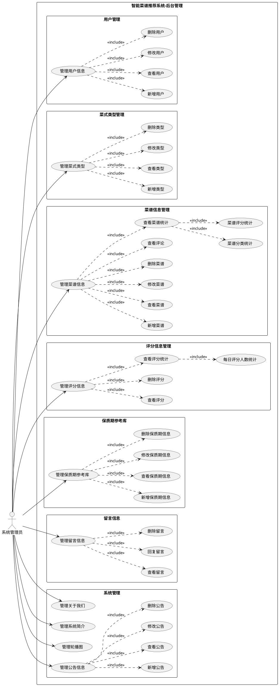

# 智能菜谱推荐系统 - 管理员用例图

## 📋 基于实际后台管理系统

根据后台管理系统（http://localhost:8082/）的实际菜单生成。

---

## 🎯 管理员用例列表

### 1. 用户管理模块

#### 1.1 管理用户信息
**用例名称：** 管理用户信息  
**参与者：** 系统管理员  
**前置条件：** 管理员已登录后台系统  
**主要流程：**
1. 管理员进入用户管理页面
2. 系统显示用户列表
3. 管理员可以执行以下操作：
   - 新增用户
   - 查看用户详情
   - 修改用户信息
   - 删除用户账号

**后置条件：** 用户信息被成功管理  
**涉及表：** `yonghu`

---

### 2. 菜式类型管理模块

#### 2.1 管理菜式类型
**用例名称：** 管理菜式类型  
**参与者：** 系统管理员  
**前置条件：** 管理员已登录后台系统  
**主要流程：**
1. 管理员进入菜式类型管理页面
2. 系统显示菜式类型列表
3. 管理员可以执行以下操作：
   - 新增菜式类型
   - 查看类型详情
   - 修改类型信息
   - 删除菜式类型

**后置条件：** 菜式类型被成功管理  
**涉及表：** `caishileixing`

---

### 3. 菜谱信息管理模块

#### 3.1 管理菜谱信息
**用例名称：** 管理菜谱信息  
**参与者：** 系统管理员  
**前置条件：** 管理员已登录后台系统  
**主要流程：**
1. 管理员进入菜谱信息管理页面
2. 系统显示菜谱列表
3. 管理员可以执行以下操作：
   - 新增菜谱
   - 查看菜谱详情
   - 修改菜谱信息
   - 删除菜谱
   - 查看菜谱评论

**后置条件：** 菜谱信息被成功管理  
**涉及表：** `caipuxinxi`

#### 3.2 查看菜谱统计
**用例名称：** 查看菜谱统计  
**参与者：** 系统管理员  
**前置条件：** 管理员已登录后台系统  
**主要流程：**
1. 管理员进入菜谱信息管理页面
2. 点击统计功能
3. 系统显示以下统计信息：
   - 菜谱分类统计
   - 菜谱评分统计
   - 首页总数统计
   - 首页统计图表

**后置条件：** 显示统计数据  
**涉及表：** `caipuxinxi`, `pingfenxinxi`

---

### 4. 评分信息管理模块

#### 4.1 管理评分信息
**用例名称：** 管理评分信息  
**参与者：** 系统管理员  
**前置条件：** 管理员已登录后台系统  
**主要流程：**
1. 管理员进入评分信息管理页面
2. 系统显示评分列表
3. 管理员可以执行以下操作：
   - 查看评分详情
   - 删除不当评分

**后置条件：** 评分信息被成功管理  
**涉及表：** `pingfenxinxi`

#### 4.2 查看评分统计
**用例名称：** 查看评分统计  
**参与者：** 系统管理员  
**前置条件：** 管理员已登录后台系统  
**主要流程：**
1. 管理员进入评分信息管理页面
2. 点击统计功能
3. 系统显示以下统计信息：
   - 每日评分人数统计
   - 首页总数统计
   - 首页统计图表

**后置条件：** 显示统计数据  
**涉及表：** `pingfenxinxi`

---

### 5. 保质期参考库模块

#### 5.1 管理保质期参考库
**用例名称：** 管理保质期参考库  
**参与者：** 系统管理员  
**前置条件：** 管理员已登录后台系统  
**主要流程：**
1. 管理员进入保质期参考库页面
2. 系统显示食材保质期列表
3. 管理员可以执行以下操作：
   - 新增食材保质期信息
   - 查看保质期详情
   - 修改保质期数据
   - 删除保质期记录

**后置条件：** 保质期参考库被成功管理  
**涉及表：** `shicai_shelf_life`

---

### 6. 留言信息管理模块

#### 6.1 管理留言信息
**用例名称：** 管理留言信息  
**参与者：** 系统管理员  
**前置条件：** 管理员已登录后台系统  
**主要流程：**
1. 管理员进入留言信息管理页面
2. 系统显示留言列表
3. 管理员可以执行以下操作：
   - 查看留言详情
   - 回复用户留言
   - 删除不当留言

**后置条件：** 留言信息被成功管理  
**涉及表：** `messages`

---

### 7. 系统管理模块

#### 7.1 管理关于我们
**用例名称：** 管理关于我们  
**参与者：** 系统管理员  
**前置条件：** 管理员已登录后台系统  
**主要流程：**
1. 管理员进入系统管理 → 关于我们
2. 系统显示当前内容
3. 管理员可以执行以下操作：
   - 查看当前内容
   - 修改页面内容
   - 上传图片

**后置条件：** 关于我们页面被成功更新  
**涉及表：** `aboutus`

#### 7.2 管理系统简介
**用例名称：** 管理系统简介  
**参与者：** 系统管理员  
**前置条件：** 管理员已登录后台系统  
**主要流程：**
1. 管理员进入系统管理 → 系统简介
2. 系统显示当前内容
3. 管理员可以执行以下操作：
   - 查看当前内容
   - 修改简介内容

**后置条件：** 系统简介被成功更新  
**涉及表：** `systemintro`

#### 7.3 管理轮播图
**用例名称：** 管理轮播图  
**参与者：** 系统管理员  
**前置条件：** 管理员已登录后台系统  
**主要流程：**
1. 管理员进入系统管理 → 轮播图管理
2. 系统显示当前轮播图
3. 管理员可以执行以下操作：
   - 查看轮播图
   - 修改轮播图
   - 上传新图片

**后置条件：** 轮播图被成功更新  
**涉及表：** `config`

#### 7.4 管理公告信息
**用例名称：** 管理公告信息  
**参与者：** 系统管理员  
**前置条件：** 管理员已登录后台系统  
**主要流程：**
1. 管理员进入系统管理 → 公告信息
2. 系统显示公告列表
3. 管理员可以执行以下操作：
   - 新增公告
   - 查看公告详情
   - 修改公告内容
   - 删除公告

**后置条件：** 公告信息被成功管理  
**涉及表：** `news`

---

## 📊 用例图（PlantUML格式）



---

## 📝 用例简化列表（用于绘图）

### 管理员用例（7大模块）

```
系统管理员
├── 1. 用户管理
│   ├── 1.1 新增用户
│   ├── 1.2 查看用户
│   ├── 1.3 修改用户
│   └── 1.4 删除用户
│
├── 2. 菜式类型管理
│   ├── 2.1 新增类型
│   ├── 2.2 查看类型
│   ├── 2.3 修改类型
│   └── 2.4 删除类型
│
├── 3. 菜谱信息管理
│   ├── 3.1 新增菜谱
│   ├── 3.2 查看菜谱
│   ├── 3.3 修改菜谱
│   ├── 3.4 删除菜谱
│   ├── 3.5 查看评论
│   └── 3.6 查看统计
│       ├── 3.6.1 菜谱分类统计
│       └── 3.6.2 菜谱评分统计
│
├── 4. 评分信息管理
│   ├── 4.1 查看评分
│   ├── 4.2 删除评分
│   └── 4.3 查看统计
│       └── 4.3.1 每日评分人数统计
│
├── 5. 保质期参考库
│   ├── 5.1 新增保质期信息
│   ├── 5.2 查看保质期信息
│   ├── 5.3 修改保质期信息
│   └── 5.4 删除保质期信息
│
├── 6. 留言信息管理
│   ├── 6.1 查看留言
│   ├── 6.2 回复留言
│   └── 6.3 删除留言
│
└── 7. 系统管理
    ├── 7.1 管理关于我们
    ├── 7.2 管理系统简介
    ├── 7.3 管理轮播图
    └── 7.4 管理公告信息
        ├── 7.4.1 新增公告
        ├── 7.4.2 查看公告
        ├── 7.4.3 修改公告
        └── 7.4.4 删除公告
```

---

## 🎯 核心用例（简化版）

如果需要简化的用例图，可以只包含主要用例：

```
系统管理员
├── 管理用户信息
├── 管理菜式类型
├── 管理菜谱信息
├── 管理评分信息
├── 管理保质期参考库
├── 管理留言信息
└── 系统管理
    ├── 管理关于我们
    ├── 管理系统简介
    ├── 管理轮播图
    └── 管理公告信息
```

---

## 📊 用例统计

| 模块 | 主要用例数 | 子用例数 | 总计 |
|------|-----------|---------|------|
| 用户管理 | 1 | 4 | 5 |
| 菜式类型管理 | 1 | 4 | 5 |
| 菜谱信息管理 | 2 | 6 | 8 |
| 评分信息管理 | 2 | 3 | 5 |
| 保质期参考库 | 1 | 4 | 5 |
| 留言信息管理 | 1 | 3 | 4 |
| 系统管理 | 4 | 4 | 8 |
| **总计** | **12** | **28** | **40** |

---

## 🔗 用例关系说明

### Include关系（包含）
- 管理用户信息 include 新增/查看/修改/删除用户
- 管理菜式类型 include 新增/查看/修改/删除类型
- 管理菜谱信息 include 新增/查看/修改/删除菜谱、查看评论、查看统计
- 管理评分信息 include 查看/删除评分、查看统计
- 管理保质期参考库 include 新增/查看/修改/删除保质期信息
- 管理留言信息 include 查看/回复/删除留言
- 管理公告信息 include 新增/查看/修改/删除公告

### Extend关系（扩展）
- 查看统计 extend 管理菜谱信息（可选功能）
- 查看统计 extend 管理评分信息（可选功能）

---

## 🎨 绘图建议

### 使用工具
1. **PlantUML** - 使用上面提供的代码
2. **Draw.io** - 手动绘制
3. **Visual Paradigm** - 专业UML工具
4. **StarUML** - 开源工具

### 布局建议
1. **管理员** 放在左侧
2. **用例** 按模块分组，从上到下排列：
   - 用户管理
   - 菜式类型管理
   - 菜谱信息管理
   - 评分信息管理
   - 保质期参考库
   - 留言信息管理
   - 系统管理

### 颜色建议
- 管理员：蓝色
- 核心用例（CRUD）：绿色
- 统计用例：橙色
- 系统配置用例：紫色

---

## 📝 与实际系统对应

| 后台菜单 | 用例 | 数据表 |
|---------|------|--------|
| 用户管理 | 管理用户信息 | yonghu |
| 菜式类型管理 | 管理菜式类型 | caishileixing |
| 菜谱信息管理 | 管理菜谱信息 | caipuxinxi |
| 评分信息管理 | 管理评分信息 | pingfenxinxi |
| 保质期参考库 | 管理保质期参考库 | shicai_shelf_life |
| 留言信息 | 管理留言信息 | messages |
| 系统管理 → 关于我们 | 管理关于我们 | aboutus |
| 系统管理 → 系统简介 | 管理系统简介 | systemintro |
| 系统管理 → 轮播图管理 | 管理轮播图 | config |
| 系统管理 → 公告信息 | 管理公告信息 | news |

---

## 🎓 用例图绘制步骤

### 步骤1：绘制参与者
```
在图的左侧绘制一个小人图标，标注"系统管理员"
```

### 步骤2：绘制系统边界
```
绘制一个大矩形，标注"智能菜谱推荐系统-后台管理"
```

### 步骤3：绘制用例
```
在系统边界内，按模块绘制椭圆形用例：
- 管理用户信息
- 管理菜式类型
- 管理菜谱信息
- 管理评分信息
- 管理保质期参考库
- 管理留言信息
- 管理关于我们
- 管理系统简介
- 管理轮播图
- 管理公告信息
```

### 步骤4：连接关系
```
从管理员到每个用例画实线箭头
```

### 步骤5：添加子用例（可选）
```
如果需要详细展示，可以为每个主用例添加子用例
使用虚线箭头标注<<include>>关系
```

---

**文档版本**：v1.0  
**创建日期**：2026-01-08  
**基于系统**：后台管理系统 v2.0  
**作者**：Kiro AI Assistant
